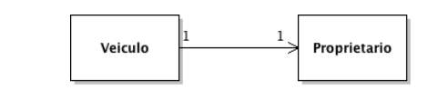
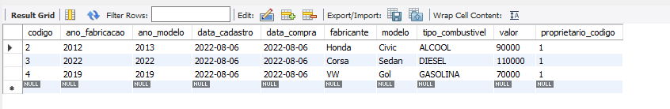
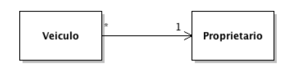
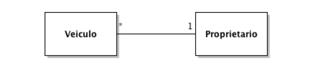
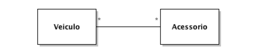
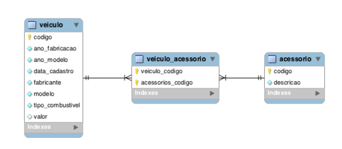
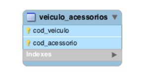
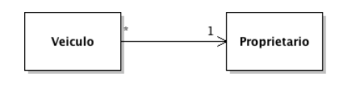
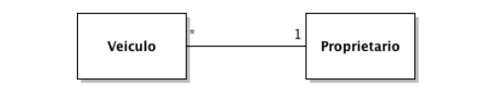

# associacoes-jpa

## Associações um-para-um

O relacionamento um-para-um, também conhecido como one-to-one, pode ser
usado para dividir uma entidade em duas (criando duas tabelas), para ficar mais
normalizado e fácil de entender.

Esse tipo de associação poderia ser usado entre Veiculo e Proprietario.

Precisamos apenas anotar a classe Proprietario com @Entity e, opcionalmente,
@Table. Além disso, incluímos também um atributo codigo, para armazenar o
identificador da entidade (chave primária) e implementamos os métodos
hashCode e equals.

@Entity
@Table(name = "proprietario")
public class Proprietario {
private Long codigo;
private String nome;
private String telefone;
private String email;
@Id
@GeneratedValue
public Long getCodigo() {
return codigo;
}
public void setCodigo(Long codigo) {
this.codigo = codigo;
}
@Column(length = 60, nullable = false)
public String getNome() {
return nome;
}
public void setNome(String nome) {
this.nome = nome;
}
@Column(length = 20, nullable = false)
public String getTelefone() {
return telefone;
}
public void setTelefone(String telefone) {
this.telefone = telefone;
}
@Column(length = 255)
public String getEmail() {
return email;

}
public void setEmail(String email) {
this.email = email;
}
// hashCode e equals
}

Na classe Veiculo, adicionamos a propriedade proprietario e mapeamos com
@OneToOne.

public class Veiculo {
...
private Proprietario proprietario;
...
@OneToOne
public Proprietario getProprietario() {
return proprietario;
}
...
}

Podemos tentar persistir um novo veículo associado a um proprietário.

public class PersistindoDados {
public static void main(String[] args) {
EntityManager manager= JPAUtil.getEntityManager();
EntityTransaction tx= manager.getTransaction();

        //quando o JPA faz alguma operação que não é uma simples leitura do BD ele precisa de uma transação
        tx.begin();//inicia uma transação com o BD

        Proprietario proprietario=new Proprietario("Jose alfredo","11 5656-8989","jose@gmail.com");

        //persistir objetos(inserir registros no Bancod e dados)
        Veiculo veiculo= new Veiculo("Honda","Civic",2012,2013,90000.00, TipoCombustivel.ALCOOL, new Date(), LocalDate.now(),proprietario);
        Veiculo veiculo1= new Veiculo("Corsa ","Sedan",2022,2022,110000.00,TipoCombustivel.DIESEL, new Date(),LocalDate.now(),proprietario);
        Veiculo veiculo2= new Veiculo("VW","Gol",2019,2019,70000.00,TipoCombustivel.GASOLINA, new Date(),LocalDate.now(),proprietario);

        manager.persist(veiculo);
        manager.persist(veiculo1);
        manager.persist(veiculo2);

        tx.commit();

        manager.close();
        JPAUtil.close();

    }
}

Quando executamos o código acima, recebemos uma exceção, dizendo que o
objeto do tipo Veiculo possui uma propriedade que faz referência a um objeto
transiente do tipo Proprietario.

Caused by: org.hibernate.TransientPropertyValueException: object
references an unsaved transient instance - save the transient
instance before flushing: Veiculo.proprietario -> Proprietario

Precisamos de uma instância persistida de proprietário para atribuir ao veículo.

public class PersistindoDados {
public static void main(String[] args) {
EntityManager manager= JPAUtil.getEntityManager();
EntityTransaction tx= manager.getTransaction();

        //quando o JPA faz alguma operação que não é uma simples leitura do BD ele precisa de uma transação
        tx.begin();//inicia uma transação com o BD

        Proprietario proprietario=new Proprietario("Jose alfredo","11 5656-8989","jose@gmail.com");

        manager.persist(proprietario);

        //persistir objetos(inserir registros no Bancod e dados)
        Veiculo veiculo= new Veiculo("Honda","Civic",2012,2013,90000.00, TipoCombustivel.ALCOOL, new Date(), LocalDate.now(),proprietario);
        Veiculo veiculo1= new Veiculo("Corsa ","Sedan",2022,2022,110000.00,TipoCombustivel.DIESEL, new Date(),LocalDate.now(),proprietario);
        Veiculo veiculo2= new Veiculo("VW","Gol",2019,2019,70000.00,TipoCombustivel.GASOLINA, new Date(),LocalDate.now(),proprietario);

        manager.persist(veiculo);
        manager.persist(veiculo1);
        manager.persist(veiculo2);

        tx.commit();

        manager.close();
        JPAUtil.close();

    }
}

Veja a saída da execução:

Hibernate:
insert
into
proprietario
(email, nome, telefone)
values
(?, ?, ?)
Hibernate:
insert
into
tab_veiculo
(ano_fabricacao, ano_modelo, data_cadastro, fabricante, modelo,
proprietario_codigo, tipo_combustivel, valor)
values
(?, ?, ?, ?, ?, ?, ?, ?)

Note que foi criada uma coluna proprietario_codigo na tabela tab_veiculo.

Por padrão, o nome da coluna é definido com o nome do atributo da associação,
mais underscore, mais o nome do atributo do identificador da entidade destino.
Podemos mudar isso com a anotação @JoinColumn.

@OneToOne
@JoinColumn(name = "cod_proprietario")
public Proprietario getProprietario() {
return proprietario;
}

O relacionamento one-to-one aceita referências nulas, por padrão. Podemos
obrigar a atribuição de proprietário durante a persistência de Veiculo, incluindo
o atributo optional com valor false, na anotação @OneToOne.

@OneToOne(optional = false)
public Proprietario getProprietario() {
return proprietario;
}

Dessa forma, se tentarmos persistir um veículo sem proprietário, uma exceção é
lançada.

Caused by: org.hibernate.PropertyValueException: not-null property
references a null or transient value: Veiculo.proprietario

## Associação bidirecional

A associação que fizemos entre veículo e proprietário é unidirecional, ou seja,
podemos obter o proprietário a partir de um veículo, mas não conseguimos obter
o veículo a partir de um proprietário.

Para tornar a associação um-para-um bidirecional e então conseguirmos obter
o veículo a partir de um proprietário, precisamos apenas incluir uma nova
propriedade na classe Proprietario e mapearmos com @OneToOne usando o
atributo mappedBy.

@Entity
@Table(name = "proprietario")
public class Proprietario {
...
@OneToOne(mappedBy = "proprietario")
private Veiculo veiculo;
...

public Veiculo getVeiculo() {
return veiculo;
}
...
}

O valor de mappedBy deve ser igual ao nome da propriedade na classe Veiculo que
associa com Proprietario.

## Associações muitos-para-um

Na última seção, mapeamos a propriedade proprietario na entidade Veiculo
com um-para-um. Mudaremos o relacionamento agora para many-to-one. Dessa
forma, um veículo poderá possuir apenas um proprietário, mas um proprietário
poderá estar associado a muitos veículos.

Vamos remover a propriedade veiculo da entidade Proprietario e alterar o
mapeamento de proprietario na classe Veiculo.

public class Veiculo {
...
private Proprietario proprietario;
...
@ManyToOne
@JoinColumn(name = "cod_proprietario")
public Proprietario getProprietario() {
return proprietario;
}
...
}

A anotação @ManyToOne indica a multiplicidade do relacionamento entre veículo e
proprietário.

Vamos persistir um proprietário e 2 veículos, que pertencem ao mesmo dono.

EntityManager manager = JpaUtil.getEntityManager();
EntityTransaction tx = manager.getTransaction();
tx.begin();

Proprietario proprietario = new Proprietario();
proprietario.setNome("João das Couves");
proprietario.setTelefone("(34) 1234-5678");

manager.persist(proprietario);

Veiculo veiculo1 = new Veiculo();
veiculo1.setFabricante("GM");
veiculo1.setModelo("Celta");
veiculo1.setAnoFabricacao(2006);
veiculo1.setAnoModelo(2006);
veiculo1.setValor(new BigDecimal(11_000));
veiculo1.setTipoCombustivel(TipoCombustivel.GASOLINA);
veiculo1.setDataCadastro(new Date());
veiculo1.setProprietario(proprietario);

manager.persist(veiculo1);

Veiculo veiculo2 = new Veiculo();
veiculo2.setFabricante("VW");
veiculo2.setModelo("Gol");
veiculo2.setAnoFabricacao(2010);
veiculo2.setAnoModelo(2010);
veiculo2.setValor(new BigDecimal(17_200));
veiculo2.setTipoCombustivel(TipoCombustivel.BICOMBUSTIVEL);
veiculo2.setDataCadastro(new Date());
veiculo2.setProprietario(proprietario);

manager.persist(veiculo2);

tx.commit();
manager.close();
JpaUtil.close();

Para deixar a associação bidirecional, precisamos mapear um atributo na
entidade Proprietario, usando a @OneToMany. Veremos isso na próxima seção.

## Coleções um-para-muitos

A anotação @OneToMany deve ser utilizada para mapear coleções.

Mapearemos o inverso da associação many-to-one, que fizemos na última seção,
indicando que um proprietário pode ter muitos veículos.

Incluiremos a propriedade veiculos na entidade Proprietario, do tipo List.

public class Proprietario {
...
private List<Veiculo> veiculos;
...
@OneToMany(mappedBy = "proprietario")
public List<Veiculo> getVeiculos() {
return veiculos;
}
...
}

Para testar esse relacionamento, execute o código abaixo, que busca um
proprietário e lista todos os veículos dele.

public static void main(String[] args) {

        EntityManager manager= JPAUtil.getEntityManager();

        Proprietario proprietario=manager.find(Proprietario.class,2L);

        System.out.println("Proprietario: "+proprietario.getNome());

        for (Veiculo veiculo: proprietario.getVeiculos()
             ) {
            System.out.println("Veiculo: "+veiculo.getModelo());

        }

        manager.close();
        JPAUtil.close();

    }

Veja a saída da execução do código acima:
Hibernate:
    select
        proprietar0_.codigo as codigo1_0_0_,
        proprietar0_.email_proprietario as email_pr2_0_0_,
        proprietar0_.nome_proprietario as nome_pro3_0_0_,
        proprietar0_.telefone_proprietatio as telefone4_0_0_
    from
        proprietario proprietar0_
    where
        proprietar0_.codigo=?
Proprietario: Maria da Silva
Hibernate:
    select
        veiculos0_.cod_proprietario as cod_pro10_1_0_,
        veiculos0_.codigo as codigo1_1_0_,
        veiculos0_.codigo as codigo1_1_1_,
        veiculos0_.ano_fabricacao as ano_fabr2_1_1_,
        veiculos0_.ano_modelo as ano_mode3_1_1_,
        veiculos0_.data_cadastro as data_cad4_1_1_,
        veiculos0_.data_compra as data_com5_1_1_,
        veiculos0_.fabricante as fabrican6_1_1_,
        veiculos0_.modelo as modelo7_1_1_,
        veiculos0_.cod_proprietario as cod_pro10_1_1_,
        veiculos0_.tipo_combustivel as tipo_com8_1_1_,
        veiculos0_.valor as valor9_1_1_
    from
        tab_veiculos veiculos0_
    where
        veiculos0_.cod_proprietario=?
Veiculo: Sedan
Veiculo: Gol

A primeira query foi executada para buscar o proprietário. A segunda, para
pesquisar a lista de veículos do proprietário.

Note que a segunda consulta só foi executada quando chamamos o método
getVeiculos. Esse comportamento é chamado de lazy-loading, e será estudado
mais adiante.

## Coleções muitos-para-muitos

Para praticar o relacionamento many-to-many, criaremos uma entidade Acessorio,
que representa os acessórios que um carro pode ter. Dessa forma, um veículo
poderá possuir vários acessórios e um acessório poderá estar associado a vários
veículos.

A classe Acessorio é uma entidade sem nenhuma novidade nos mapeamentos.

@Entity
@Table(name = "acessorio")
public class Acessorio {

    @Id
    @GeneratedValue(strategy = GenerationType.AUTO)
    private Long codigo;

    @Column(length = 60, nullable = false)
    private String descricao;

    public Acessorio(String descricao) {
        this.descricao = descricao;
    }

    public Long getCodigo() {
        return codigo;
    }

    public void setCodigo(Long codigo) {
        this.codigo = codigo;
    }

    public String getDescricao() {
        return descricao;
    }

    public void setDescricao(String descricao) {
        this.descricao = descricao;
    }

// hashCode e equals
}

Na entidade Veiculo, criamos um atributo acessorios do tipo Set. Definimos
como um conjunto, pois um veículo não poderá possuir o mesmo acessório
repetido. Usamos a anotação @ManyToMany para mapear a propriedade de coleção.

public class Veiculo {
...
@ManyToMany
private Set<Acessorio> acessorios = new HashSet<>();
...

public Set<Acessorio> getAcessorios() {
return acessorios;
}
...
}
Esse tipo de relacionamento precisará de uma tabela de associação para que a
multiplicidade muitos-para-muitos funcione. O recurso hbm2ddl poderá criar as
tabelas automaticamente.

Por padrão, um mapeamento com @ManyToMany cria a tabela de associação com os
nomes das entidades relacionadas, separados por underscore, com duas colunas,
com nomes também gerados automaticamente.

Podemos customizar o nome da tabela de associação e das colunas com a
anotação @JoinTable.

@ManyToMany
@JoinTable(name = "veiculo_acessorios",
joinColumns = @JoinColumn(name = "cod_veiculo"),
inverseJoinColumns = @JoinColumn(name = "cod_acessorio")
)
private Set<Acessorio> acessorios=new HashSet<>();

Neste exemplo, definimos o nome da tabela de associação como
veiculo_acessorios, o nome da coluna que faz referência para a tabela de veículos
como cod_veiculo e da coluna que referencia à tabela de acessórios como
cod_acessorio (lado inverso).

Vamos inserir e relacionar alguns acessórios e veículos.

        EntityManager manager= JPAUtil.getEntityManager();
        EntityTransaction tx= manager.getTransaction();
        tx.begin();

        //instacia proprietario
        Proprietario proprietario=new Proprietario("Jose alfredo","11 5656-8989","jose@gmail.com");
        Proprietario proprietario2=new Proprietario("Maria da Silva","11 5656-8989","jose@gmail.com");
        //persiste veiculo
        manager.persist(proprietario);
        manager.persist(proprietario2);

        //Instancia acessórios
        Acessorio alarme = new Acessorio("Alarme");
        Acessorio arCondicionado = new Acessorio("Ar Condicionado");
        Acessorio bancosDeCouro = new Acessorio("Bancos de Couro");
        Acessorio direcaoHidraulica = new Acessorio("Direção Hidraúlica");
        //persiste acessorio
        manager.persist(alarme);
        manager.persist(arCondicionado);
        manager.persist(bancosDeCouro);
        manager.persist(direcaoHidraulica);

        //Instancia Veiculo
        Veiculo veiculo= new Veiculo("Hyundai","I30",2012,2013,90000.00, TipoCombustivel.ALCOOL, new Date(), LocalDate.now(),proprietario);
        Veiculo veiculo1= new Veiculo("Corsa ","Sedan",2022,2022,110000.00,TipoCombustivel.DIESEL, new Date(),LocalDate.now(),proprietario2);
        Veiculo veiculo2= new Veiculo("VW","Gol",2019,2019,70000.00,TipoCombustivel.GASOLINA, new Date(),LocalDate.now(),proprietario2);

        veiculo.getAcessorios().add(arCondicionado);
        veiculo.getAcessorios().add(alarme);
        veiculo.getAcessorios().add(bancosDeCouro);
        veiculo.getAcessorios().add(direcaoHidraulica);

        veiculo1.getAcessorios().add(alarme);
        veiculo1.getAcessorios().add(arCondicionado);

        veiculo2.getAcessorios().add(alarme);

        //persiste veiculo
        manager.persist(veiculo);
        manager.persist(veiculo1);
        manager.persist(veiculo2);

        tx.commit();
        manager.close();
        JPAUtil.close();

    }
}

O provedor de persistência incluirá os registros nas 3 tabelas.

Consultando acessórios de um veículo

EntityManager manager = JpaUtil.getEntityManager();
Veiculo veiculo = manager.find(Veiculo.class, 2L);
System.out.println("Veículo: " + veiculo.getModelo());
for (Acessorio acessorio : veiculo.getAcessorios()) {
System.out.println("Acessório: " + acessorio.getDescricao());
}
manager.close();
JpaUtil.close();

Veja a saída da execução do código acima:

Hibernate:
select
veiculo0_.codigo as codigo1_1_0_,
veiculo0_.ano_fabricacao as ano_fabr2_1_0_,
veiculo0_.ano_modelo as ano_mode3_1_0_,
veiculo0_.data_cadastro as data_cad4_1_0_,
veiculo0_.fabricante as fabrican5_1_0_,
veiculo0_.modelo as modelo6_1_0_,

veiculo0_.tipo_combustivel as tipo_com7_1_0_,
veiculo0_.valor as valor8_1_0_
from
veiculo veiculo0_
where
veiculo0_.codigo=?
Veículo: i30
Hibernate:
select
acessorios0_.cod_veiculo as cod_veic1_1_1_,
acessorios0_.cod_acessorio as cod_aces2_2_1_,
acessorio1_.codigo as codigo1_0_0_,
acessorio1_.descricao as descrica2_0_0_
from
veiculo_acessorios acessorios0_
inner join
acessorio acessorio1_
on acessorios0_.cod_acessorio=acessorio1_.codigo
where
acessorios0_.cod_veiculo=?
Acessório: Bancos de couro
Acessório: Direção hidráulica
Acessório: Alarme
Acessório: Ar condicionado

## Associação bidirecional

A associação que fizemos entre veículo e proprietário é unidirecional, ou seja,
podemos obter o proprietário a partir de um veículo, mas não conseguimos obter
o veículo a partir de um proprietário.

Para tornar a associação um-para-um bidirecional e então conseguirmos obter
o veículo a partir de um proprietário, precisamos apenas incluir uma nova
propriedade na classe Proprietario e mapearmos com @OneToOne usando o
atributo mappedBy.

@Entity
@Table(name = "proprietario")
public class Proprietario {
...
private Veiculo veiculo;
...
@OneToOne(mappedBy = "proprietario")
public Veiculo getVeiculo() {
return veiculo;
}
...
}
O valor de mappedBy deve ser igual ao nome da propriedade na classe Veiculo que
associa com Proprietario.

## Associações muitos-para-um

Na última seção, mapeamos a propriedade proprietario na entidade Veiculo
com um-para-um. Mudaremos o relacionamento agora para many-to-one. Dessa
forma, um veículo poderá possuir apenas um proprietário, mas um proprietário
poderá estar associado a muitos veículos.

Vamos remover a propriedade veiculo da entidade Proprietario e alterar o
mapeamento de proprietario na classe Veiculo.

public class Veiculo {
...
private Proprietario proprietario;
...
@ManyToOne
@JoinColumn(name = "cod_proprietario")
public Proprietario getProprietario() {
return proprietario;
}
...
}

A anotação @ManyToOne indica a multiplicidade do relacionamento entre veículo e
proprietário.
Vamos persistir um proprietário e 2 veículos, que pertencem ao mesmo dono.

## Coleções um-para-muitos

A anotação @OneToMany deve ser utilizada para mapear coleções.

Mapearemos o inverso da associação many-to-one, que fizemos na última seção,
indicando que um proprietário pode ter muitos veículos.

Incluiremos a propriedade veiculos na entidade Proprietario, do tipo List.

## Herança

Mapear herança de classes que representam tabelas no banco de dados pode ser
uma tarefa complexa e nem sempre pode ser a melhor solução. Use este recurso
com moderação. Muitas vezes é melhor você mapear usando associações do que
herança.

